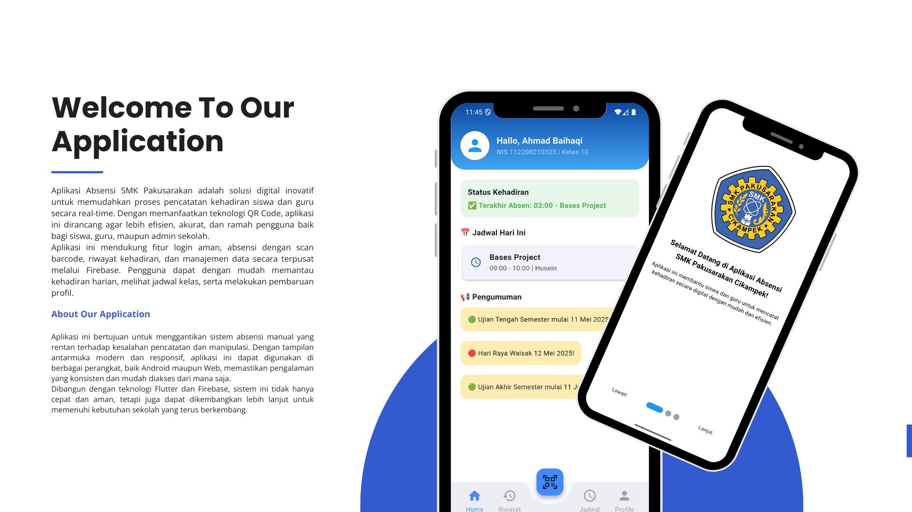

# 📚 Aplikasi Absensi Siswa, Guru, dan Admin

Aplikasi Absensi Sekolah adalah solusi digital berbasis **Flutter** (mobile dan web) yang terintegrasi dengan **Firebase**. Aplikasi ini mempermudah proses absensi siswa melalui pemindaian QR code dan menyediakan fitur manajemen data, jadwal, serta laporan kehadiran secara real-time untuk siswa, guru, dan admin.

---

## 🚀 Fitur Utama

### 🔐 Autentikasi

- Siswa, Guru, dan Admin login menggunakan **email & password** terverifikasi melalui Firebase Authentication.
- **Lupa Password**: Tersedia fitur reset password otomatis melalui email dengan tautan dari Firebase.

### 👤 Manajemen Profil

- Siswa dan Guru dapat **melengkapi** dan **mengubah** profil (nama, NIS/NIP, kelas, jurusan, foto, dll).
- Admin dapat melihat dan mengelola semua data pengguna.

---

## 🧑‍💼 Fitur untuk Admin dan Guru (via Web)

- **Dashboard Web Admin**: Hanya dapat diakses oleh admin dan guru melalui browser.
- **Manajemen User**:
  - Admin dapat menambahkan akun **siswa, guru, dan admin**.
  - Tidak ada fitur registrasi mandiri, akun hanya dapat dibuat oleh admin.
  - Guru hanya bisa menambahkan **siswa**.
- **Manajemen Jadwal**:
  - Admin dapat melihat, menambah, mengedit, dan menghapus jadwal pelajaran.
  - Guru hanya dapat melihat jadwal pelajaran.
- **Manajemen Data Siswa**: Melihat, mengedit, dan menghapus data siswa.
- **Manajemen Data Admin dan Guru**: Hanya admin yang bisa melihat, mengedit, dan menghapus data admin dan guru.
- **Rekap Kehadiran**:
  - Guru dapat melihat, menambah, mengedit, dan menghapus riwayat kehadiran siswa.
  - Admin hanya dapat melihat riwayat kehadiran siswa.
- **Ekspor Data**:
  - Ekspor **data absensi** dan **data profil siswa/guru** ke format Excel (.xlsx).
  - Filter berdasarkan tanggal, kelas, dan mata pelajaran.

---

## 🧑‍🏫 Fitur untuk Guru (via Aplikasi)

- **Manajemen Jadwal Mengajar**: Melihat jadwal mengajar sesuai kelas dan hari.
- **Generate QR Code**: Menampilkan QR code yang digunakan siswa untuk absensi.
- **Lihat Riwayat Kehadiran Siswa**: Berdasarkan jadwal yang dimiliki.

---

## 🧑‍🎓 Fitur untuk Siswa

- **Scan QR Code**: Melakukan absensi dengan memindai barcode dari guru.
- **Lihat Jadwal Hari Ini & Semua Jadwal**: Berdasarkan kelas siswa.
- **Riwayat Kehadiran**: Menampilkan absensi yang telah dilakukan.
- **Status Kehadiran Hari Ini**: Tampilkan apakah siswa sudah absen atau belum.

---

## 🛠 Teknologi yang Digunakan

- **Flutter**: Untuk mobile app (Android) dan web admin.
- **Firebase Authentication**: Sistem login, verifikasi, dan reset password.
- **Cloud Firestore**: Database utama untuk menyimpan user, jadwal, barcode, dan absensi.
- **Firebase Storage**: Menyimpan foto profil pengguna.
- **Flutter Web**: Untuk fitur admin & guru berbasis browser.
- **Excel Export**: Menggunakan `syncfusion_flutter_xlsio` package untuk generate file `.xlsx`.

---

## 📱 Preview Antarmuka Pengguna

<p align="center">
  
</p>

---

## 📦 Cara Menjalankan

### 1. Clone Repository:

```bash
git clone https://github.com/Hasanmudzakir4/absensi-sekolah.git
cd absensi-sekolah
```
